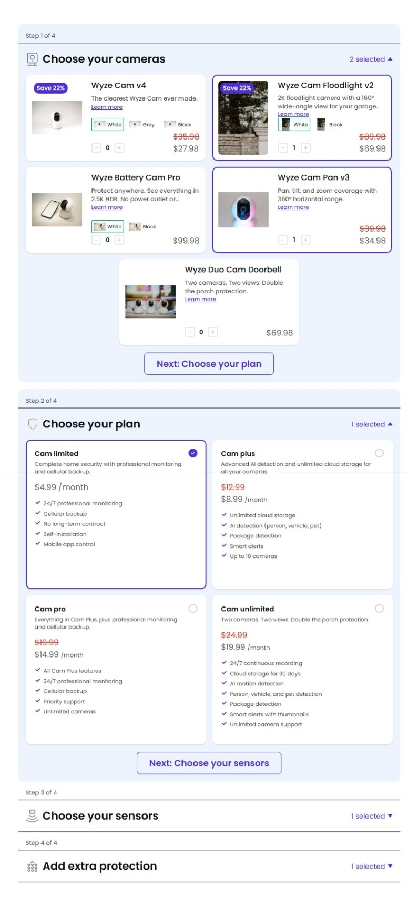
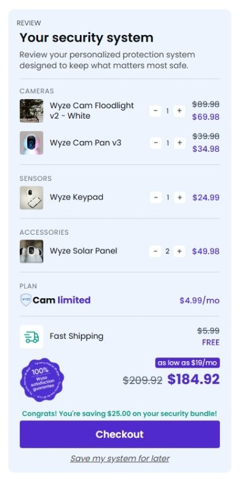
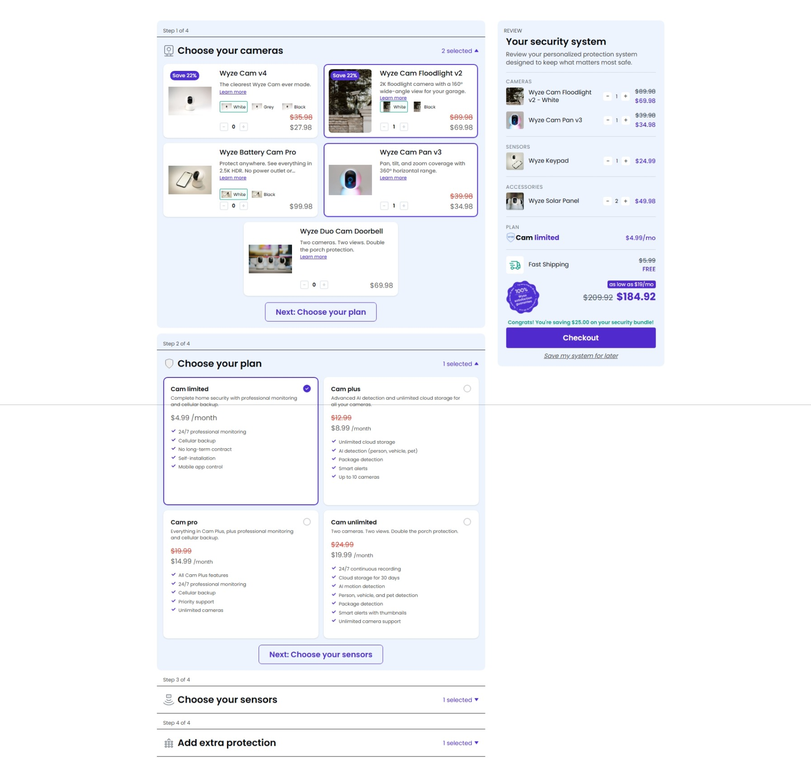
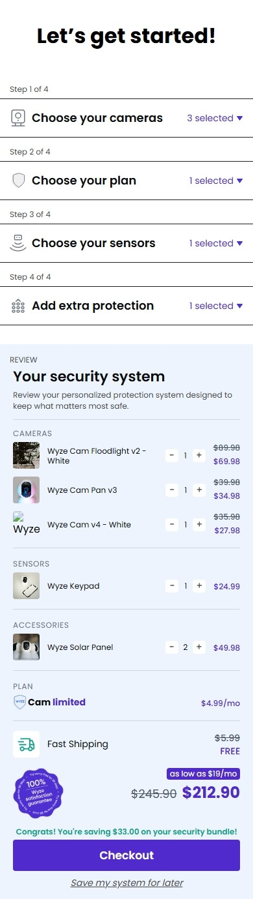

# Bundle Builder

A frontend take-home assignment that implements a Wyze-style security system configurator. Users build a custom security bundle by selecting cameras, sensors, accessories, and a monitoring plan through a multi-step accordion interface with a live review panel. Built with React, Vite, Tailwind CSS, and driven entirely by local JSON data.

## Features

- **Multi-step accordion builder** -- Four expandable steps guide the user through cameras, plan selection, sensors, and accessories.
- **Data-driven UI from JSON** -- All product, plan, and pricing data is rendered from a single `products.json` file. Adding or removing products requires no component changes.
- **Product variant selection** -- Products with color or style options (e.g., White, Grey, Black) offer an in-card variant picker.
- **Variant-specific quantity tracking** -- Each variant of a product is tracked independently in the bundle state.
- **Live review panel** -- A side panel reflects every selection in real time, organized by category.
- **Quantity synchronization** -- Quantity steppers in both the builder and the review panel stay in sync through a shared state layer.
- **Automatic total and savings calculations** -- The review panel computes subtotals, compares against original prices, and displays savings.
- **LocalStorage persistence** -- A "Save my system for later" button serializes the bundle state to localStorage. The bundle is restored automatically on page reload.
- **Responsive design** -- The layout switches from a side-by-side builder-plus-review layout on desktop to a stacked single-column layout on mobile.
- **Reusable component architecture** -- UI primitives (`Section`, `SectionLabel`, `QuantityStepper`, `Price`, `CheckIcon`) are separated from business-logic components (`ProductCard`, `PlanCard`, `VariantSelector`, `ReviewItemRow`).

## Tech Stack

- **React 19** -- UI library
- **Vite 8** -- Build tool and dev server
- **JavaScript (ES Modules)** -- Application logic
- **Tailwind CSS 4** -- Utility-first styling
- **Context API + useReducer** -- State management
- **LocalStorage** -- Client-side persistence

## Project Structure

```
bundle-builder/
  products.json              # All product, plan, and pricing data
  index.html                 # Vite entry point
  vite.config.js             # Vite configuration with React and Tailwind plugins
  package.json
  eslint.config.js
  public/                    # Static assets
  src/
    main.jsx                 # ReactDOM entry
    App.jsx                  # Root layout (Builder + ReviewPanel)
    index.css                # Global styles and Tailwind directives
    context/
      BundleContext.jsx       # Bundle state (Context + useReducer, ADD/REMOVE/PLAN/CLEAR actions)
    hooks/
      useProductSelection.js  # Per-product selection, variant state, quantity logic
      useSelectedCount.js     # Counts selected items per step
    components/
      Builder/
        Builder.jsx           # Accordion container, iterates over STEPS config
        Step.jsx              # Collapsible step wrapper
        Products.jsx          # Renders product cards or plan cards per step category
        ProductCard.jsx       # Product display with image, price, variant picker, add/remove
        PlanCard.jsx          # Plan selection card
        VariantSelector.jsx   # Color/swatch variant picker
      Review/
        ReviewPanel.jsx       # Side panel: categories, totals, save functionality
        ReviewCategories.jsx  # Groups review items by category
        ReviewItemRow.jsx     # Individual item row with quantity stepper
        ReviewCategoryHeader.jsx
        ReviewSummary.jsx     # Total, savings, and satisfaction badge section
        FastShippingRow.jsx
      UI/
        Section.jsx           # Reusable collapsible section wrapper
        SectionLabel.jsx      # Section header with step count
        QuantityStepper.jsx   # Reusable minus/plus quantity control
        Price.jsx             # Price display with optional strikethrough
        CheckIcon.jsx         # SVG check icon
    utils/
      constants.js            # Step definitions (STEPS array)
      helpers.js              # formatPrice, getBundleKey utility functions
    assets/
      icons/                  # SVG icons for steps and UI
```

## Key Implementation Details

### Data-driven rendering

`products.json` contains the complete product catalog, plan tiers, pricing, variant options, and step/category mappings. The `Builder` component reads the `STEPS` constant (defined in `constants.js`), filters products by category, and renders them generically. The review panel indexes products into a lookup map from the same JSON to resolve names, prices, and images.

### Accordion workflow

The `Builder` maintains an `expandedSteps` set. Only one step is expanded at a time (single-accordion behavior), but users may also toggle steps open or closed via click. Each `Section` wraps a `Step` which contains either `Products` (for cameras, sensors, accessories) or plan cards.

### Variant handling

Products with a non-empty `variants` array render a `VariantSelector` row within their card. When a variant is selected, the bundle key becomes `{productId}|{variantId}` (e.g., `wyze-cam-v4|v4-white`), allowing each variant to be added or quantity-adjusted independently. Products without variants use the plain `productId` as the key.

### Quantity management

The bundle reducer supports `ADD` and `REMOVE` actions. `ADD` increments the quantity by 1 (creating the entry if absent). `REMOVE` decrements the quantity and deletes the entry when it reaches 0. This decouples quantity state from individual components and ensures a single source of truth.

### Review panel synchronization

The `ReviewPanel` reads directly from the same `BundleContext` as the builder. It rebuilds its category groups on every render via `buildCategoryGroups()`, ensuring the review panel always reflects the current state. Quantity steppers in both panels dispatch the same `ADD`/`REMOVE` actions.

### LocalStorage persistence

On "Save my system for later", the entire `{ items, plan }` state is serialized to `localStorage.setItem("bundle", ...)`. The `BundleProvider` initializes its reducer state by reading from localStorage on mount. If no saved bundle is found, it defaults to an empty state.

### Responsive layout approach

Tailwind breakpoints (`max-sm:`) are used at the layout level. The `App` component switches from a horizontal flex row (`flex-row`) to a vertical flex column (`flex-col`) on small screens. Individual components use responsive padding, font sizing, and width overrides to adapt without duplicated markup.

## Installation

```bash
npm install
npm run dev
```

Open the URL shown in the terminal (default `http://localhost:5173`).

### Build for production

```bash
npm run build
npm run preview
```

## Usage

1. **Select products** -- Click "Add to bundle" on any camera, sensor, or accessory card.
2. **Choose variants** -- If a product has color or style options, select a variant before adding.
3. **Adjust quantities** -- Use the minus and plus buttons on any added item to change quantities. Quantity controls appear both in the builder card and in the review panel.
4. **Choose a plan** -- Step 2 presents subscription plan tiers. Select one to add it to the review.
5. **Review and save** -- The review panel updates live. Click "Save my system for later" to persist the bundle to localStorage. On return, the bundle is restored automatically.

## Design Decisions

- **Context API for state** -- The bundle state is lightweight (a map of items and a plan ID). `useReducer` with explicit action types (`ADD`, `REMOVE`, `PLAN`, `CLEAR`) provides predictable state transitions without the overhead of a larger state management library.
- **JSON-driven architecture** -- All product data lives in `products.json`. This makes the application trivial to connect to a backend API later -- swap the static import for a fetch call.
- **Component-based decomposition** -- UI primitives (`QuantityStepper`, `Price`, `Section`) are separated from domain components (`ProductCard`, `ReviewItemRow`). This keeps presentation logic reusable and testable in isolation.
- **Separation of concerns** -- Custom hooks (`useProductSelection`, `useSelectedCount`) encapsulate logic that would otherwise clutter components. Business rules (variant key construction, price formatting) live in `helpers.js`.
- **LocalStorage over server persistence** -- As a frontend-only assignment, LocalStorage provides a zero-infrastructure way to demonstrate persistence. The save/restore contract is simple enough that migrating to a database-backed API would require only replacing the provider's initialization and the save handler.

## Trade-offs and Notes

- **No backend** -- The assignment specification allowed the use of local JSON data. All product, plan, and pricing data is mocked in `products.json`.
- **Data is static** -- Products are imported via a static ES module import. A production version would fetch from an API.
- **Checkout is a placeholder** -- The final step label reads "Checkout" but no checkout flow or payment integration is implemented. The scope was the configurator experience.
- **No state management library** -- Context + useReducer was sufficient for the current state shape. If the application grew to include user auth, multi-page flows, or server synchronization, a library like Zustand or Redux would be worth evaluating.
- **No automated tests** -- Tests were outside the scope of the assignment. The component architecture is designed to make unit and integration testing straightforward to add.

## Future Improvements

- Backend API integration to replace static JSON imports
- User accounts and server-side persistence
- Checkout flow with payment processing
- Automated unit and integration tests (vitest + React Testing Library)
- Product search and filtering
- Animation and transition improvements for the accordion
- Accessibility audit and keyboard navigation enhancements
- TypeScript migration for improved type safety

## Screenshots

### Builder

The multi-step accordion used to configure cameras, plans, sensors, and protection options.



### Review Panel

The live summary panel showing selected products, quantities, pricing, savings, and checkout information.



### Desktop View

Full desktop experience with the builder and review panel displayed side-by-side.



### Mobile View

Responsive layout optimized for smaller screens while preserving usability and visual consistency.



## Author

**Ahmed Elsifi**  
Third-Year Computer Science Student  
MERN Stack Developer
